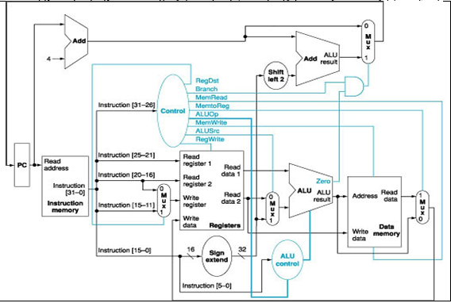
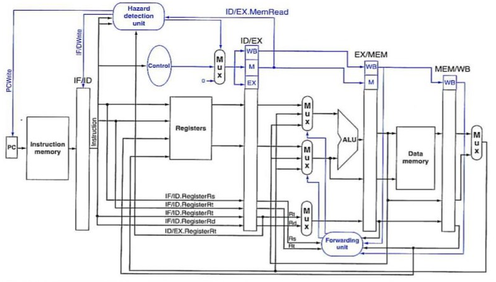

<div align="center">

# 🖥️ Computer Organization and Design

[](https://github.com)
[](https://github.com)
[](https://github.com)
[](https://github.com)

</div>

---

<div align="center">

## 📚 Course Overview

</div>

This repository contains the projects developed for the **Computer Organization and Design** course ECE163 from my 2nd year. The curriculum covers the full hierarchy of computer systems, from assembly-level programming to the structural hardware design of a MIPS-based processor and system-level memory analysis.

<div align="center">

| **Domain** | **Technologies** | **Key Skills** |
|------------|------------------|---------------------|
| **Low-Level Programming** | MIPS Assembly | System calls, Register Management, Stack Operations |
| **Digital System Design** | Verilog HDL | RTL Design, Datapath, Control Units, Testbenches |
| **Algorithmic Analysis** | C Language | Memory Management, Performance Benchmarking |
| **Memory Systems** | Theoretical Analysis | Virtual Memory, TLB, Cache Miss Rates, AMAT |

</div>

---

<div align="center">

## 📂 Project Structure

</div>

### Section 1: MIPS Assembly Programming (Labs 1-3)
* **Lab 1: Assembly Fundamentals** - Implementation of user interaction using system calls for input/output. Features bitwise logic (XOR, SRAV) and dynamic string printing in the MARS environment.
* **Lab 2: Data Compression Algorithms** - Design and implementation of **Data Compression/Decompression** routines. Focuses on byte-level memory manipulation, pointer arithmetic, and string encoding/decoding.
* **Lab 3: Recursive Sorting Algorithms** - Implementation of a **QuickSort-based** algorithm. Compares iterative logic vs. Recursive function calls, focusing on deep Stack Management ($sp$) and register preservation.

### Section 2: Digital Design with Verilog HDL (Labs 4-7)
* **Lab 4: Implementation of basic MIPS modules** - Hardware implementation of the **32-bit ALU** (supporting arithmetic, logical, and comparison operations) and the **Register File** (32 registers with asynchronous read and synchronous write logic).
* **Lab 5: Single-Cycle Processor Integration** - Developed the main Control Unit and integrated it with the Datapath. Implemented support for R-type and I-type instruction formats, including the necessary Sign Extension logic and the Instruction Fetch mechanism using a 32-bit Program Counter (PC).
* **Lab 6: 5-Stage Pipelined Architecture** - Transition from single-cycle to a **5-stage pipeline** (IF, ID, EX, MEM, WB). Implemented a **Forwarding Unit** to resolve data hazards and **Hazard Detection** logic for pipeline stalling (bubbles). Added support for Immediate (ADDI) and Shift (SLL, SRL) instructions.
* **Lab 7: Advanced Control Flow & Hazards** - Final integration of **Branch (BEQ, BNE)** and **Jump (J)** instructions. Implemented **Pipeline Flushing** to handle control hazards and synchronized the Register File for positive-edge operations.

### 🖼️ Representative Architecture Diagrams

<table align="center">
  <tr>
    <td align="center"><b>Lab 5 Architecture </b></td>
  </tr>
  <tr>
    <td></td>
  </tr>
</table>

<table align="center">
  <tr>
    <td align="center"><b>Lab 6-7 Architecture</b></td>
  </tr>
  <tr>
    <td></td>
  </tr>
</table>

### Section 3: Performance Tuning & Memory Hierarchy (Lab 8-9)
* **Lab 8: K-Means Clustering & Cache Optimization** - Implementation of the K-Means algorithm in C for image segmentation. Performed extensive **performance profiling using `perf`** to analyze CPU cycles and Cache misses. Optimized the algorithm by addressing **memory alignment issues** and **cache locality** using heavy BMP datasets.

    * **Dataset & Input Files:**
        Due to the large size (~500MB) and licensing of the high-resolution BMP images used for benchmarking, the dataset is not included in this repository.
    
    * **How to reproduce results:**
        1. Use any high-resolution `.bmp` images (24-bit/32-bit) or the course-provided dataset.
        2. Place the `.bmp` files into the `section_3/lab8/` directory.
        3. **Compile & Run:**
           ```bash
           cd section_3/lab8
           make
           ./kmeans <input_image.bmp> <output_image.bmp> <clusters>
           ```
        4. **Profile Performance:**
           ```bash
           perf stat -e L1-dcache-load-misses,LLC-load-misses ./kmeans input.bmp output.bmp 4
           ```

* **Lab 9: Virtual Memory & TLB Analysis (Theoretical)** - In-depth analytical study of **Virtual-to-Physical address translation**. Calculated hit/miss rates for **TLB** and **L1 Data Cache**, and analyzed the impact of Page Faults and disk latency on the **Average Memory Access Time (AMAT)**.


<div align="center">

## 🛠️ Tools & Technologies

| Category | Tools & Technologies |
| :--- | :--- |
| **Assembly** | MARS (MIPS Assembler and Runtime Simulator) |
| **Hardware Description** | Verilog HDL |
| **Waveform Analysis** | GTKWave |
| **General Programming** | C Programming |

</div>
